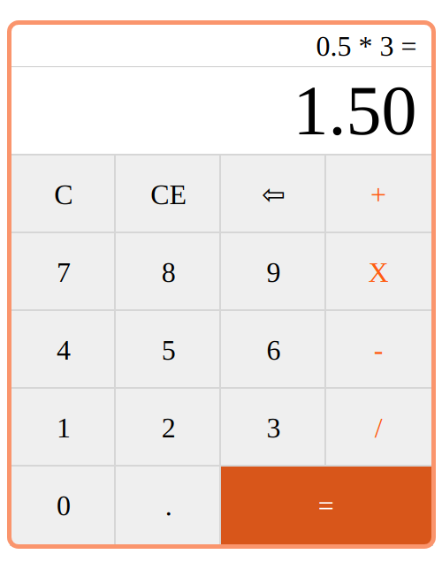

# Calculator

Made with HTML, CSS, Vanilla Javascript to perform math calculations without using eval() and new Function().

**Link to project**: https://brianbud.github.io/calculator/

## About Project

This calculator can handle all basic add, multiply, substract, divide operations.

other things I kept in mind when building this:

- what to happen when pressing the = before entering all of the numbers.
- making sure long answers are rounded to avoid them overflow the screen.
- adding a Clear entry, Clear All, and backspace undo functionality.
- Not letting users divide by 0 to avoid the app crashing.
- lets user calculate numbers with decimals.
- avoid users in adding more than 1 decimal point.

**Tech used:** HTML, CSS, Javascript

## Lessons Learnt

- I learnt why using eval() and new Function() should be avoided, and on how I could create my own math opearations.
- I learnt working with querySelectors
- i learnt how to use Flexbox to make the layout responsive
- I used the slice() method for the undo function
- I learnt about .includes() method to add 0 if there are no number when inputting a point.
- I learnt how to process numbers with Number() and toFixed() method.
- I learnt how to create branches and merge to main
